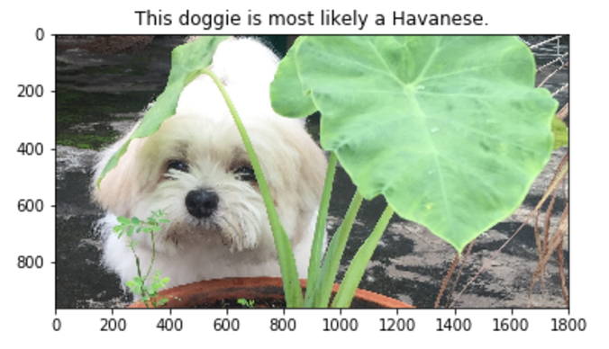

## Project Overview

In this project for the Udacity Machine Learning Nanodegree, I implemented a CNN with AWS GPU to classify dog breeds or the most resembling dog breed among 133 available breeds when given as input an image of either a dog or a human. I used two pre-trained models `ResNet-50` to detect dogs and `OpenCV-Harr Cascades` to detect human faces. In addtion, by extracting the VGG16 and Xception bottleneck features, I also leveraged transfer learning to speed up my training process without sacrificing accuracy (84% test accuracy).

<p align="center">
	
</p>

Starter code can be found [here](https://github.com/udacity/dog-project).

Below are the **steps** I took to run the Jupyter notebook on GPU on AWS:
- Create an EC2 instance in which I selected the `Ubuntu x64 with Tensorflow` as my AMI by following this [tutorial](https://hackernoon.com/keras-with-gpu-on-amazon-ec2-a-step-by-step-instruction-4f90364e49ac).
- Use scp to transfer files to my instance
```sh
## cd to the folder containing privateKey.pem and the folder I want to upload 
## 
scp -i privateKey.pem -r folderToUpload  ubuntu@Public_DNS_(IPv4):~
## replace ubuntu with ec2-user for Windows/OS
``` 
- To run Jupyter Notebook, first ssh to the instance. You can find more details in these [videos](https://www.youtube.com/watch?v=XJnpl7mQBIw).
```sh
ssh -i privateKey.pem ubuntu@Public_DNS(IPv4)

git clone https://github.com/udacity/dog-project.git

## download the dog dataset
mkdir dogImages
cd dogImages
wget https://s3-us-west-1.amazonaws.com/udacity-aind/dog-project/dogImages.zip

## download the human dataset
mkdir lfw
cd lfw
wget https://s3-us-west-1.amazonaws.com/udacity-aind/dog-project/lfw.zip

## download the VGG-16 and Xception bottleneck features
mkdir bottleneck_features
cd bottleneck_features
wget https://s3-us-west-1.amazonaws.com/udacity-aind/dog-project/DogVGG16Data.npz
wget https://s3-us-west-1.amazonaws.com/udacity-aind/dog-project/DogXceptionData.npz
```
- Then,
```sh
jupyter notebook --ip=0.0.0.0 --no-browser
### replace localhost with IPv4 Public IP in browser
```


<!-- 
## Suggestions to Make your Project Stand Out!

(Presented in no particular order ...)

#### (1) Augment the Training Data 

[Augmenting the training and/or validation set](https://blog.keras.io/building-powerful-image-classification-models-using-very-little-data.html) might help improve model performance. 

#### (2) Turn your Algorithm into a Web App

Turn your code into a web app using [Flask](http://flask.pocoo.org/) or [web.py](http://webpy.org/docs/0.3/tutorial)!  

#### (3) Overlay Dog Ears on Detected Human Heads

Overlay a Snapchat-like filter with dog ears on detected human heads.  You can determine where to place the ears through the use of the OpenCV face detector, which returns a bounding box for the face.  If you would also like to overlay a dog nose filter, some nice tutorials for facial keypoints detection exist [here](https://www.kaggle.com/c/facial-keypoints-detection/details/deep-learning-tutorial).

#### (4) Add Functionality for Dog Mutts

Currently, if a dog appears 51% German Shephard and 49% poodle, only the German Shephard breed is returned.  The algorithm is currently guaranteed to fail for every mixed breed dog.  Of course, if a dog is predicted as 99.5% Labrador, it is still worthwhile to round this to 100% and return a single breed; so, you will have to find a nice balance.  

#### (5) Experiment with Multiple Dog/Human Detectors

Perform a systematic evaluation of various methods for detecting humans and dogs in images.  Provide improved methodology for the `face_detector` and `dog_detector` functions. -->
